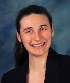
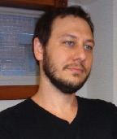

<table style="margin: auto; width: 700px; font-size: 16px;"><tr><td>

Sonya Sawtelle

- PhD, Applied Physics (Yale, 2018)
- 3 years professional experience as data scientist, AI/ML engineer
- analytics & predictive modeling including deep learning for CV & NLP
- Python, PyTorch, Kubeflow, SQL, C++, Docker

</td><td>

</td></tr></table>

<table style="margin: auto; width: 700px; font-size: 16px; margin-top: 65px;"><tr><td>

</td><td>

W. D. Brinda

- PhD, Statistics and Data Science (Yale, 2018)
- 3 years as lecture/research faculty at Yale Statistics department
- author of *Visualizing Linear Models* (Springer, 2021)
- R, Python, SAS, web/mobile development, LaTeX

</td></tr></table>

